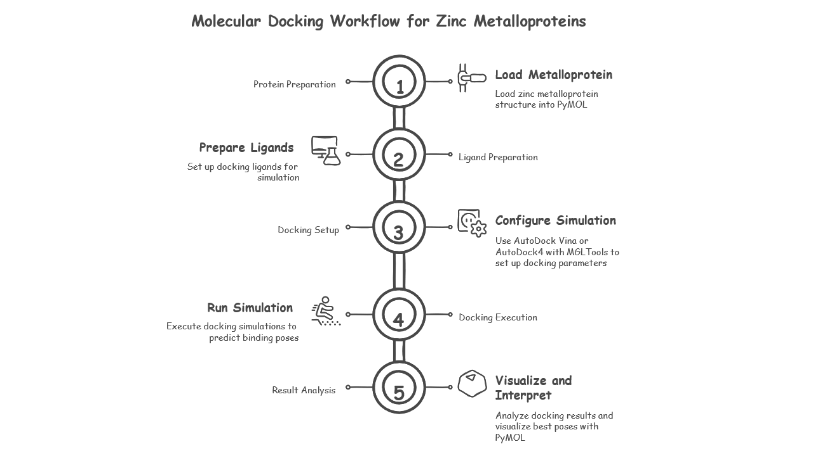

[](https://github.com/mabdelmaksoud53/ZincDock)
[](https://github.com/mabdelmaksoud53/ZincDock/blob/main/LICENSE)

# **Zinc Metalloproteins Docking**

## Hello there

Welcome to the **Zinc Metalloproteins Docking Github Repo**!

This repository provides a complete setup guide, environment configuration, scripts for performing molecular docking of zinc metalloproteins with `AutoDock Vina`, `AutoDock4`, `MGLTools`, and `PyMOL`, specifically optimized for handling `zinc metalloproteins`.

We use powerful open-source tools including AutoDock Vina, AutoDock4, MGLTools, and PyMOL, with workflows optimized specifically for zinc metalloproteins. Make sure to read the instructions carefully before using the pipeline to get the best results!

---

## Table of Contents

- [About](#about)
- [Workflow](#workflow)
- [Project Structure](#project-structure)
- [Prerequisites](#prerequisites)
- [Installation Guide](#installation-guide)
- [License](#license)

---

## About

**Zinc metalloproteins** play crucial roles in biological systems and require careful treatment during molecular docking simulations.  
This project provides:

- Easy installation scripts.
- Optimized settings for docking with zinc ions.

## Workflow



## Project-structure

```bash
ZincDock/
├── scripts/                  
├── resources/                
├── screenshots/                 
├── Example                 
├── LICENSE                   
└── README.md                    
```

## prerequisites

Make sure you have:

- A Linux distribution (Ubuntu 20.04+ recommended).
- Basic knowledge of terminal commands.
- Sufficient disk space.
- Internet connection for downloading packages.

`Required software/tools:`

- **AutoDock Vina 1.2.3** for fast and flexible docking.
- **AutoDock 4.2** for traditional docking with grid maps.
- **MGLTools 1.5.6 and 1.5.7** for ligand and receptor preparation.
- **PyMOL** for molecular visualization.
- **Anaconda** for Python environment management.

## installation-guide

- clone and build manually:

```bash
# Clone this repository
git clone https://github.com/mabdelmaksoud53/ZincDock
cd ZincDock
```

- Environment setup
- To set up your environment, follow the step-by-step instructions carefuly.
- You can find the full [Here](./Workflow/Environmental_setup.md).

## How it Works

- If you need a step-by-step guide, please follow the instructions [here](./Workflow/Zn_Dock.md)
- If you prefer an automated process, you can simply copy this [`docking_script.ah`](./scripts/docking_scripts.sh) into your working directory.
Then run the following commands:

```bash
chmod +x docking_script.sh
./docking_script.sh
```

- After running the script, enter the required inputs when prompted.

## License

This project is licensed under the MIT License - see the [LICENSE](./LICENSE) file for details.

## Contributing

- Pull requests are welcome!
- If you find an issue or have suggestions for improvements, feel free to open an issue or PR.
- Let's build better tools for computational chemistry together!
